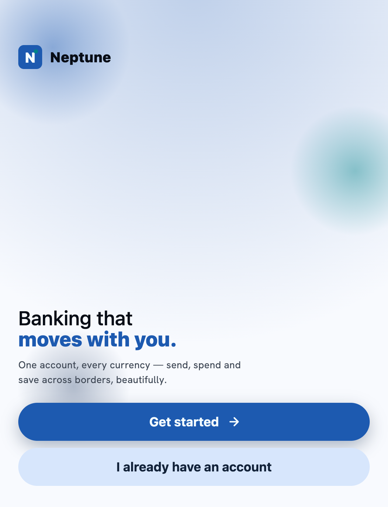
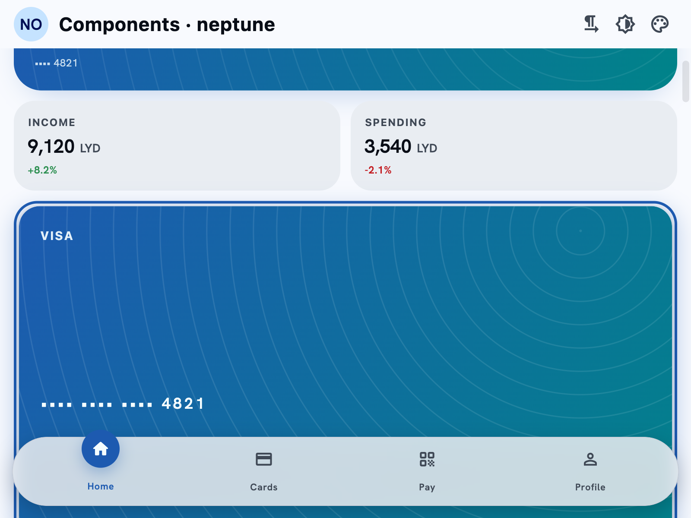
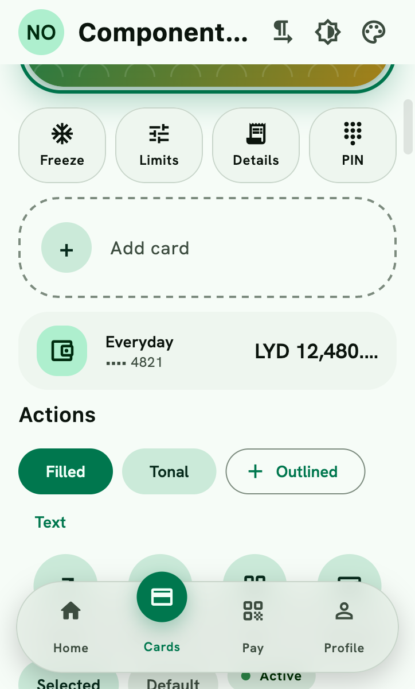
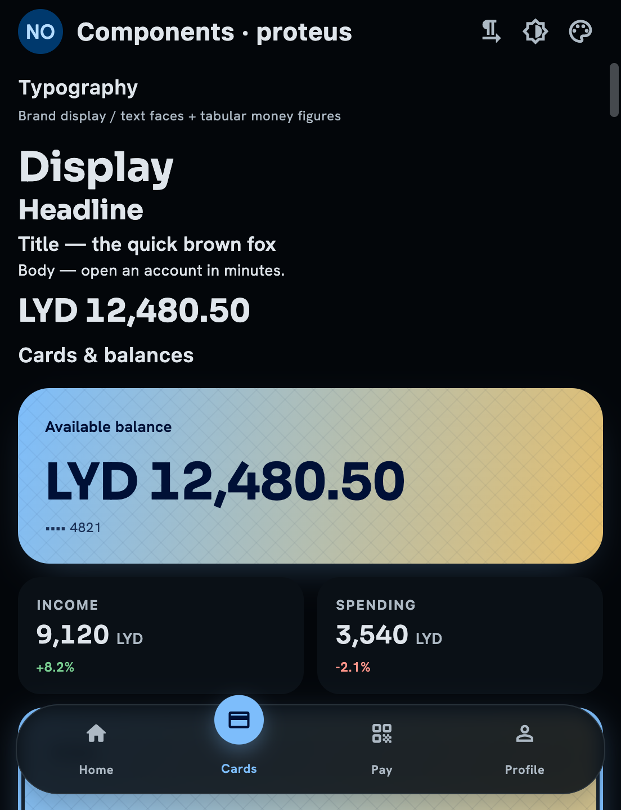
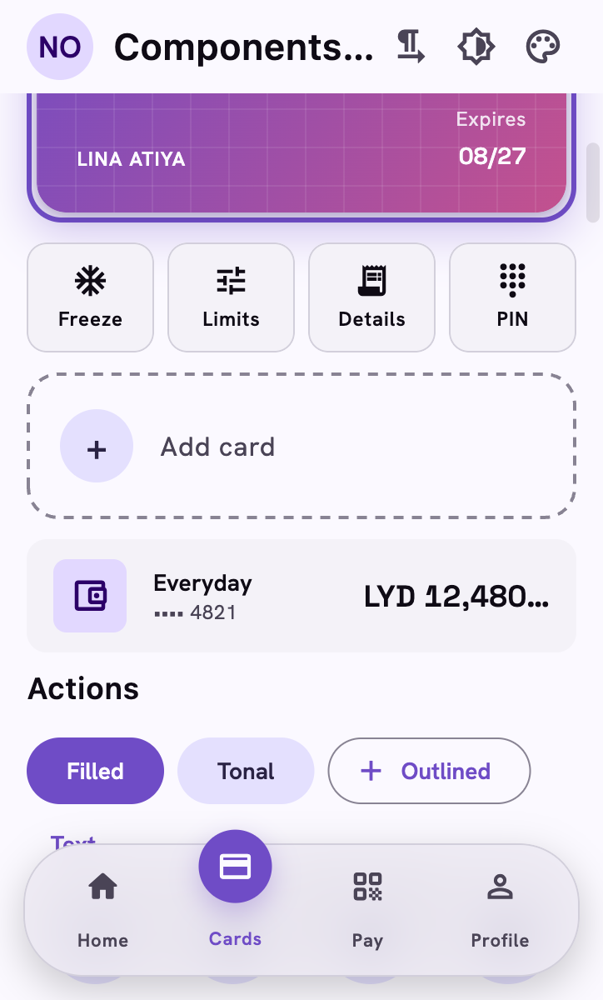
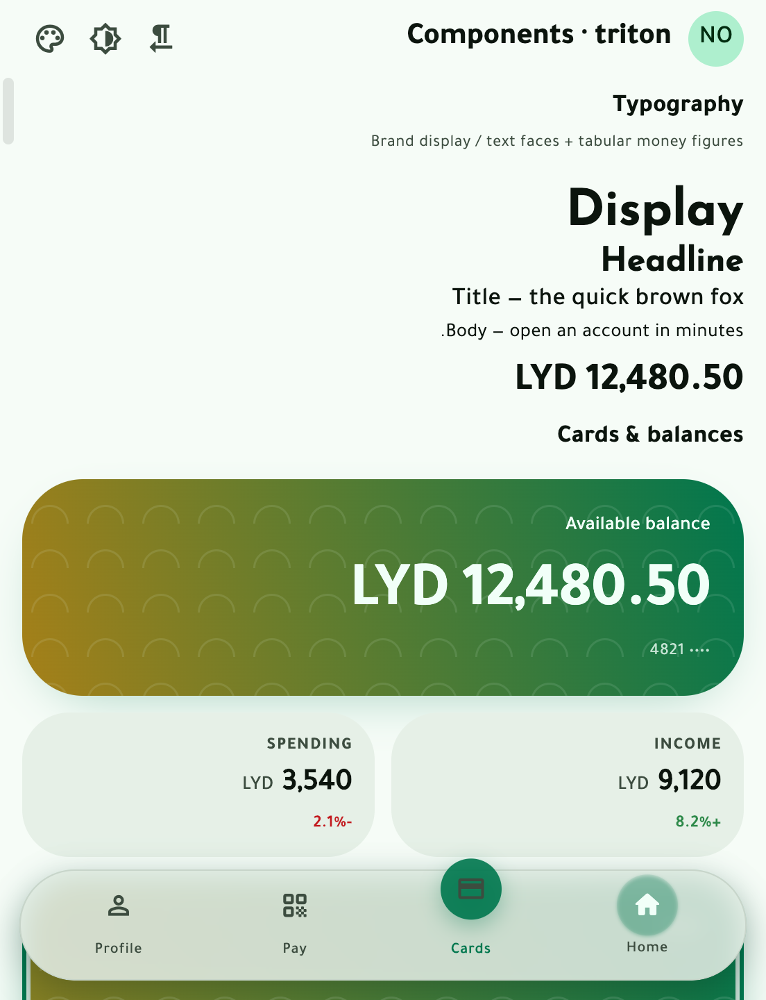
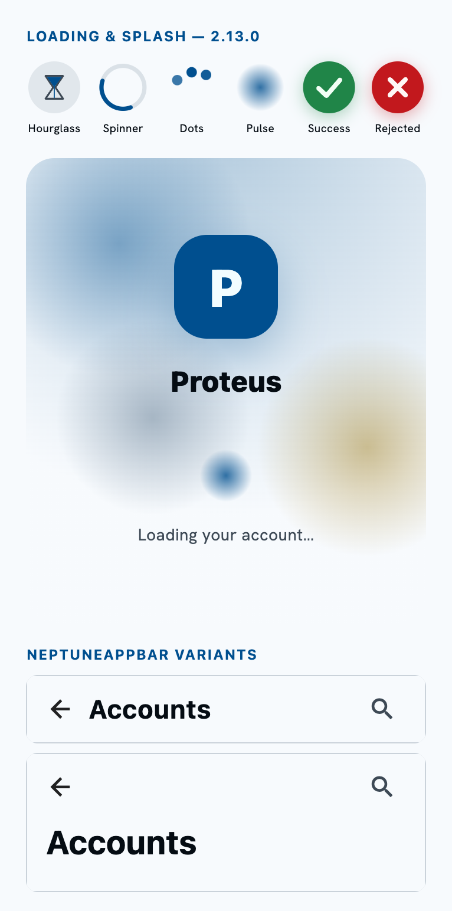

# neptune_flutter_ui

The Flutter package of **Neptune Odyssey** — the vendor-neutral, white-label
banking design system by [Neptune.Fintech](https://neptune.ly). It ships the four
reference brands (`neptune`, `triton`, `nereid`, `proteus`) plus a deterministic
**brandprint** codec so any custom tenant theme rebuilds identically across
platforms.

> Neptune Odyssey by Neptune.Fintech. Source-available under the Neptune Odyssey
> Community License v1.0 (see [`LICENSE`](LICENSE)). Free for non-commercial use
> and for organizations under USD $25,000/year; a commercial license is required
> above that threshold.

## Screens — real engine renders

Every image below is the actual package rendering in the Flutter engine
(captured via `RepaintBoundary.toImage`, not mockups). Try it live in your
browser: **<https://neptune-ly.github.io/neptune_odyssey/flutter/>**.

| Welcome / Sign-in | Dashboard hero + glass dock | Card art (Triton motif) |
|---|---|---|
|  |  |  |

| Proteus dark | Brand switch (Nereid) | Arabic / RTL |
|---|---|---|
|  |  |  |

| 2.13.0 — loaders, splash, app bar variants |
|---|
|  |

## Install

```yaml
# pubspec.yaml
dependencies:
  neptune_flutter_ui: ^2.13.0
```

Or from git:

```yaml
dependencies:
  neptune_flutter_ui:
    git:
      url: https://github.com/neptune-ly/neptune_odyssey
      path: packages/neptune_flutter_ui
```

## Theming — three entry points

A bank is a pair of `ThemeData` (light + dark). Swapping banks swaps the theme;
widgets never change. Read everything from `Theme.of(context)` — no literal
colours, radii or fonts in your widgets.

```dart
import 'package:neptune_flutter_ui/neptune_flutter_ui.dart';

// 1. By reference brand id.
MaterialApp(
  theme: NeptuneTheme.light('triton'),
  darkTheme: NeptuneTheme.dark('triton'),
  themeMode: ThemeMode.system,
);

// 2. From a brandprint string (the portable, copy-pasteable theme).
final theme = NeptuneTheme.fromBrandprint('NO1-AYB4AKKeeABWDBIaIiw4B_YBAAABAQEBAQAAyA');

// 3. From a full config (seeds, corners, type, levers, flags).
final theme2 = NeptuneTheme.fromConfig(myConfig, brightness: Brightness.dark);
```

## Brandprint

A brandprint is a short, deterministic `NO1-…` string that encodes a tenant's
theme inputs (OKLCH seeds, corner family, type, lever enums, flags). Encode and
decode are pure and idempotent.

```dart
final config = Brandprint.decode('NO1-AYB4AKKeeABWDBIaIiw4B_YBAAABAQEBAQAAyA');
final round  = Brandprint.encode(config); // == the original string

// Build a custom config and get its brandprint.
const cfg = BrandprintConfig(
  primary: Seed(l: 0.50, c: 0.12, h: 162),
  tertiary: Seed(l: 0.62, c: 0.12, h: 86),
  corners: Corners(xs: 12, sm: 18, md: 26, lg: 34, xl: 44, xxl: 56),
  displayWeight: 700,
  displayTracking: -0.01,
  fontDisplay: 'Bricolage Grotesque',
  fontText: 'Hanken Grotesk',
  fontNum: 'Hanken Grotesk',
  loginShell: 'arcade-arches',
  dashboardHero: 'warm-balance-cards',
  contentTone: 'warm-hospitable',
  glassTint: 'warm-amber',
  motion: 'calm-graceful',
);
final brandprint = Brandprint.encode(cfg);
final theme = NeptuneTheme.fromConfig(cfg);
```

## Widgets

~150 themed, RTL-safe building blocks that read the theme only — balance/account/card
surfaces, all nine screen templates, a full onboarding-flow suite, state-completeness
(`NeptuneStateSwitcher`/`NeptuneShimmer`), data-viz, corporate/approval widgets, and
`NeptuneDemoShellApp` (a complete branded demo app in ~10 lines). Full list in
[COVERAGE.md](COVERAGE.md), which also tracks parity against the web component set.

**New in 2.13.0** (see [CHANGELOG.md](CHANGELOG.md) for the full history):
- A standalone loader family — `NeptuneSpinner`, `NeptuneDotsLoader`, `NeptunePulseLoader`,
  `NeptuneHourglassLoader` — all four feeding `NeptuneStatusMotion`'s `loaderStyle`, so any
  of them can precede the same success/reject morph.
- `NeptuneSplashScreen` — the ambient welcome backdrop + brand mark + a loader, for the
  cold-start moment.
- `NeptuneAppBar` gained `variant` (`small`/`center`/`medium`/`large`) — the M3
  collapsing-header pattern.
- `NptDensity` (comfortable/compact), `NptFeedback` (haptics + an `onSoundCue` hook — see
  the sibling [`neptune_sound_kit`](../neptune_sound_kit) package), and
  `NeptuneNumeralStyle`/`NptNumerals` (Arabic-Indic digits as a lever independent of `arabic:`).
- Dark-mode elevation (`NptIdentity.elevation1..5`) now reads as a brand-tinted glow instead
  of a flat shadow; `NeptuneCta`'s motion timing is derived from each brand's own tokens
  instead of one fixed duration for every brand.

The brand `success` role, corner family, type set and motion are available as
`ThemeExtension`s: `NptColors`, `NptShape`, `NptType`, `NptMotion`, `NptIdentity`,
`NptDensity`, `NptFeedback`.

```dart
final success = Theme.of(context).extension<NptColors>()!.success;
final radius  = Theme.of(context).extension<NptShape>()!.rLg;
final money   = NeptuneTheme.moneyStyle(context); // tabular figures
```

## Determinism

The same brandprint produces an identical theme on every platform. The four
reference brands resolve via pinned canonical palettes (byte-identical to
`tokens.resolved.json`); custom seeds resolve through the shared OKLCH ramp
(CSS Color 4 path), reproducing the reference data to within ≤ 1 LSB per channel.
Any change to the palette algorithm, wire layout, or a registry bumps the
brandprint version prefix (`NO2-`).

## License

Neptune Odyssey Community License v1.0. See [`LICENSE`](LICENSE). For commercial
licensing above the revenue threshold: licensing@neptune.fintech.
